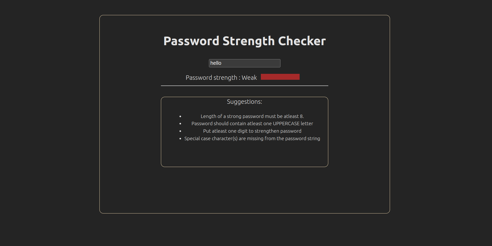
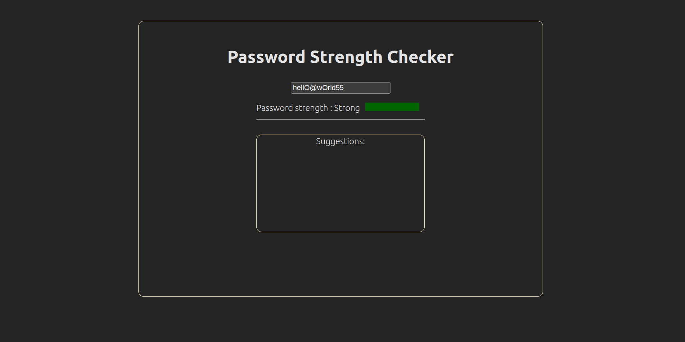

# Password Strength Checker

[Live Preview](https://password-strength-checker-rust.vercel.app/)

A React application that checks the strength of a password entered by the user. The application displays a visual indicator of the password's strength, with the following criteria:

<ul>
<li>Weak (less than 8 characters)</li>
<li>Medium (8-12 characters)</li>
<li>Strong (more than 12 characters)</li>
</ul>

### Feature Enhancements

Implementation of additional password strength criteria, such as checking for uppercase letters, numbers, and special characters.

Weak Password

Strong Password